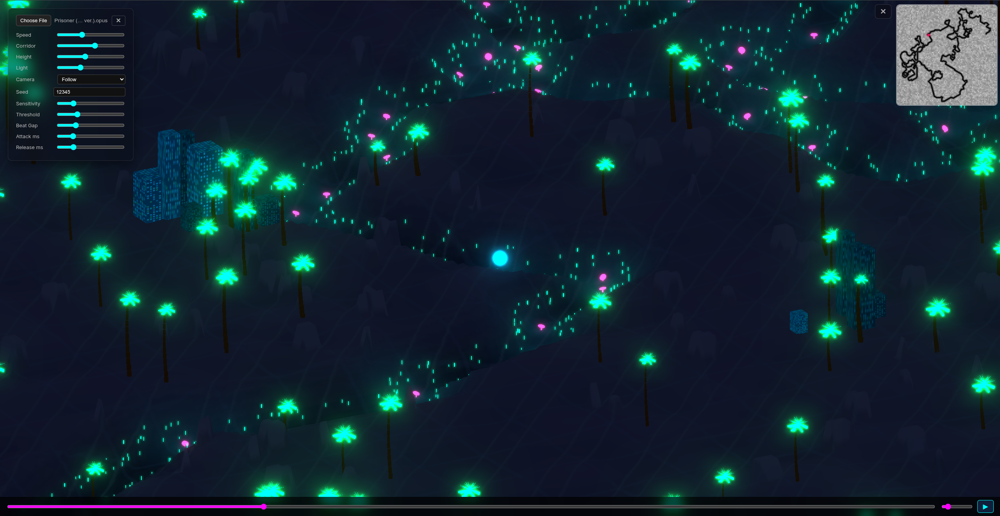

# [ Neon Beat Maze](https://dragos-florin-pojoga.github.io/TNM/)



Load an audio file and watch a the ball race through a procedurally generated neon maze, synced to the beat where the path, terrain, and decorations are all built from the music's rhythm.

## Controls

| Input | Action |
|---|---|
| **Space** | Play / Pause |
| **< >** | Skip +-5 seconds |
| **^ V** | Volume +-5% |
| **Right-click + drag** | Orbit camera |
| **Scroll wheel** | Zoom in/out |
| **W A S D** | Tilt / pan camera (WASD in Free cam) |

The control panel (top-left) exposes these sliders:

| Slider | What it does |
|---|---|
| **Speed** | Ball travel speed between beats |
| **Corridor** | Width of the carved path |
| **Height** | How tall the walls rise |
| **Light** | Directional fill light brightness |
| **Camera** | Follow, Auto-Turn, 3rd Person, Fixed, Top-Down, Free |
| **Seed** | RNG seed - same seed + track + settings = same maze |
| **Sensitivity** | Beat detection sensitivity (lower = more beats) |
| **Threshold** | Peak-picking threshold (higher = fewer false beats) |
| **Beat Gap** | Minimum spacing between detected beats |
| **Attack ms** | Envelope follower attack speed |
| **Release ms** | Envelope follower release smoothness |

## How it works

1. **Beat detection** - The audio runs through a 4-band filter bank (PureData -> WASM). A perceptual salience algorithm picks beats by tracking rhythmic density and energy transients across bass, low-mid, high-mid, and treble bands.

2. **Path generation** - Beat timestamps become a collision-free 2D path via a seeded greedy DFS with 9 possible turn angles.

3. **Terrain** - The path is rendered to a heightmap canvas, displaced onto a subdivided plane, and textured with a dark cyberpunk palette, circuit lines, and noise.

4. **Playback** - The ball follows the path in real time, bouncing at each beat crossing.

## Tech stack

- **TypeScript** + **Three.js** - 3D rendering, post-processing (bloom), instanced geometry
- **PureData** + **hvcc** + **Emscripten** - audio filter bank compiled to WebAssembly
- **Vite** - dev server and production bundling
- **Web Audio API** - real-time playback, offline rendering for beat analysis

## Build

```bash
bash scripts/build.sh
```

This runs the full pipeline: toolchain setup -> PD->WASM compilation -> TypeScript + Vite production build. Output lands in `dist/`.

## Video Demo or [Try it live](https://dragos-florin-pojoga.github.io/TNM/)

https://github.com/user-attachments/assets/80cfe9ae-08e2-453c-b81a-8941557d0fd0

> Song used: https://music.youtube.com/watch?v=MN97kf49tYM
